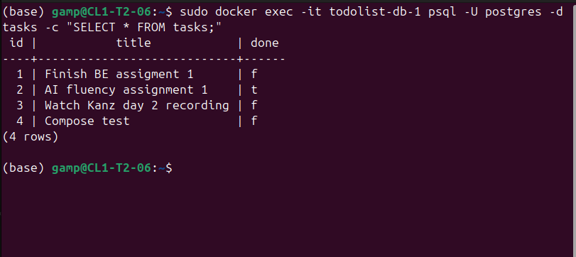
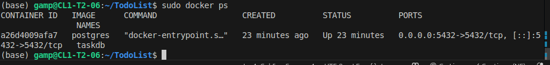
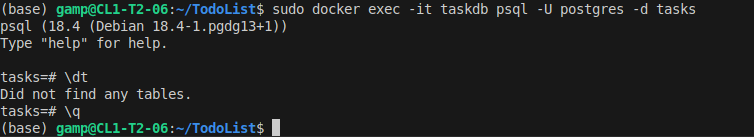
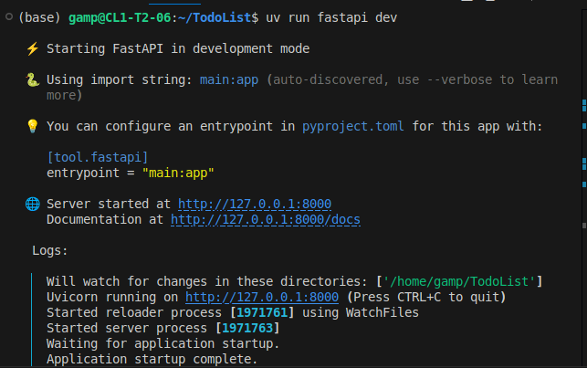
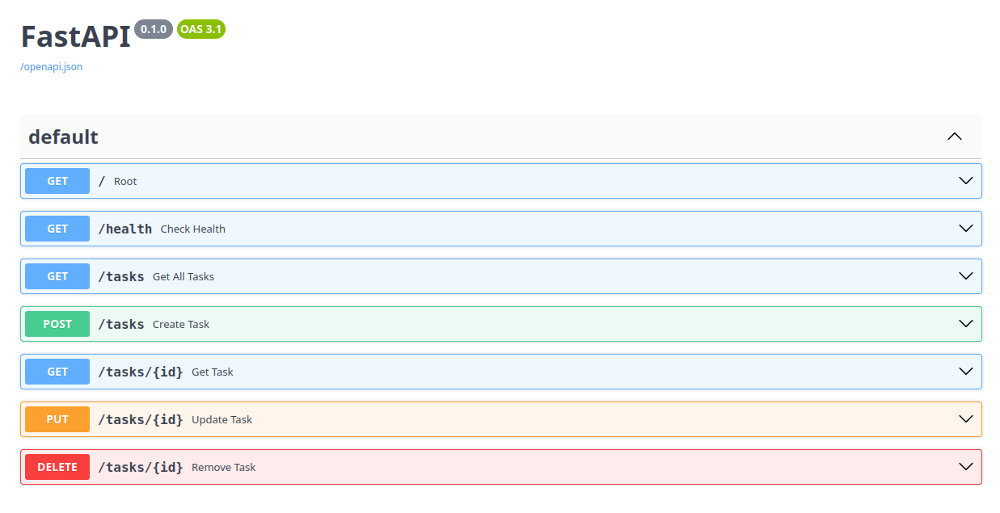
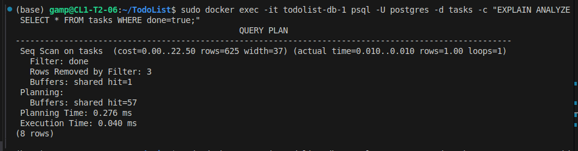
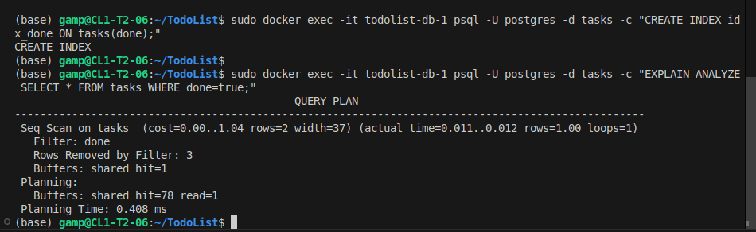
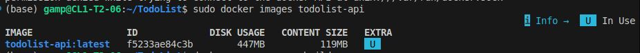
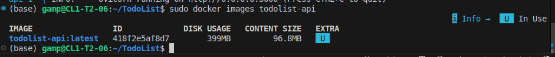

## Description

TodoList is a task management API. It lets you add, list, remove and update tasks

## Endpoints
`GET /tasks` - Retrieve all tasks
`GET /tasks/:id` - Get a task with the specified id
`POST /tasks` - Create a new task
`PUT /tasks/:id` - Update the task with the specified id
`DELETE /tasks/:id` - Remove the task with the id
`GET /stats` - Get API statistics

###  Installation & Usage
1. **Clone the Repo**
```bash
git clone https://github.com/TodoList
cd TodoList
```
2. **Run with just one command**
```bash
docker compose up
```

### Example usage
```
gamp@CL1-T2-06:~$ curl -i http://localhost:3000/tasks
HTTP/1.1 200 OK
date: Thu, 20 Aug 2026 14:09:10 GMT
server: uvicorn
content-length: 214
content-type: application/json

[{"id":2,"title":"AI fluency assignment 1","done":true},{"id":4,"title":"Compose test","done":false},{"id":1,"title":"Finish BE assigment 1","done":false},{"id":3,"title":"Watch Kanz day 2 recording","done":false}](base) 
```

### Data


## AI vs me
**with conn:** AI used context manager for automatic commit on success and automatic rollback on failure. I used manual conn.commit() with no rollback if something fails halfway.

**conn.execute()**: Instead of a shared global cursor, AI creates a fresh cursor per call, so two threads can't overwrite each other's results. Mine uses one module-level cursor shared across all requests.

**try/except sqlite3.Error** for error handling: AI returns a controlled error response if the database fails while mine lets unhandled exceptions bubble up as a generic 500.

**New cursor per request**: It directly solves the thread-safety problem with cursor results that my shared cursor is vulnerable to so two requests won't interfere with each others operations

# Running Container




## Example





## Use of Index and EXPLAIN ANALAYZE
**Index** is used to make looking for data in a table faster. It should be used on a column that is used often to filter for data. Though it should be noted  that, it adds overhead to INSERT, UPDATE and DELETE operation because creating an index on a column will create additional data structure to store the indexed rows and every of those operations will have to do execute their query then proceed to update the data structure created. Moreover, Indexing consumes more disk space

**EXPLAIN ANALYZE** runs a query and shows both the planned strategy (Seq Scan vs Index Scan, estimated costs) and the actual results (real execution time, actual row counts).

## EXPLAIN ANALYZE BEFORE and AFTER INDEXING
**Before**


**After**


As it can be seen above, EXPLAIN ANALYZE still uses a seq scan even after INDEXING the done column of the table when it should have used index scan. This is because of the low number of rows in the table - 3 rows. The postgres query planner is smart to that extent that even with an Index available, it knows that for that small number of rows, using index scan will create more overhead than using seq scan

## Docker image Size before and after multi-stage build
**Before**


**After**
