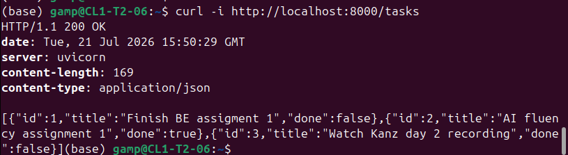

## Description

TodoList is a task management API. It lets you add, list, remove and update tasks

## Endpoints
`GET /tasks` - Retrirve all tasks
`GET /tasks/:id` - Get a task with the specified id
`POST /tasks` - Create a new task
`PUT /tasks/:id` - Update the task with the specified id
`DELETE /tasks/:id` - Remove the task with the id

###  Installation & Usage
You need to have uv installed
1. **Clone the Repo**
```bash
git clone https://github.com/TodoList
cd TodoList
```

2. **Install Requirements**
```bash
uv add
```

3. **Run the project**
You can run the project using
```bash
uv run fastapi dev
```

or

```bash
uv run main.py
```

## AI vs me
**with conn:** AI used context manager for automatic commit on success and automatic rollback on failure. I used manual conn.commit() with no rollback if something fails halfway.

**conn.execute()**: Instead of a shared global cursor, AI creates a fresh cursor per call, so two threads can't overwrite each other's results. Mine uses one module-level cursor shared across all requests.

**try/except sqlite3.Error** for error handling: AI returns a controlled error response if the database fails while mine lets unhandled exceptions bubble up as a generic 500.

**New cursor per request**: It directly solves the thread-safety problem with cursor results that my shared cursor is vulnerable to so two requests won't interfere with each others operations

## Example



